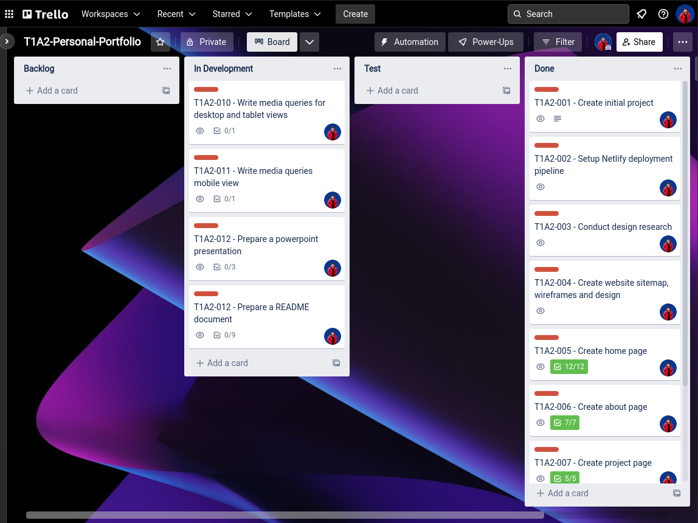
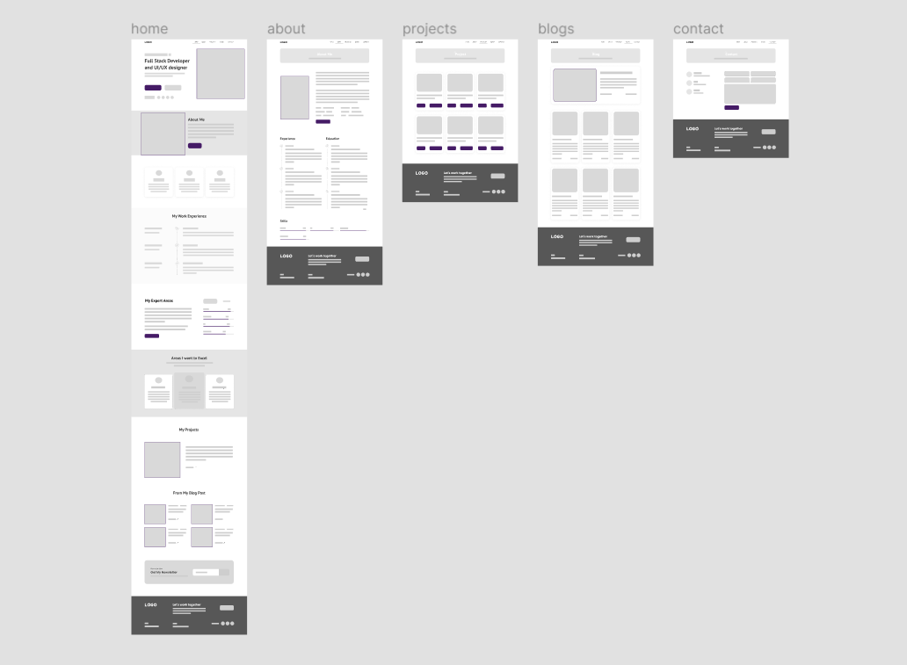
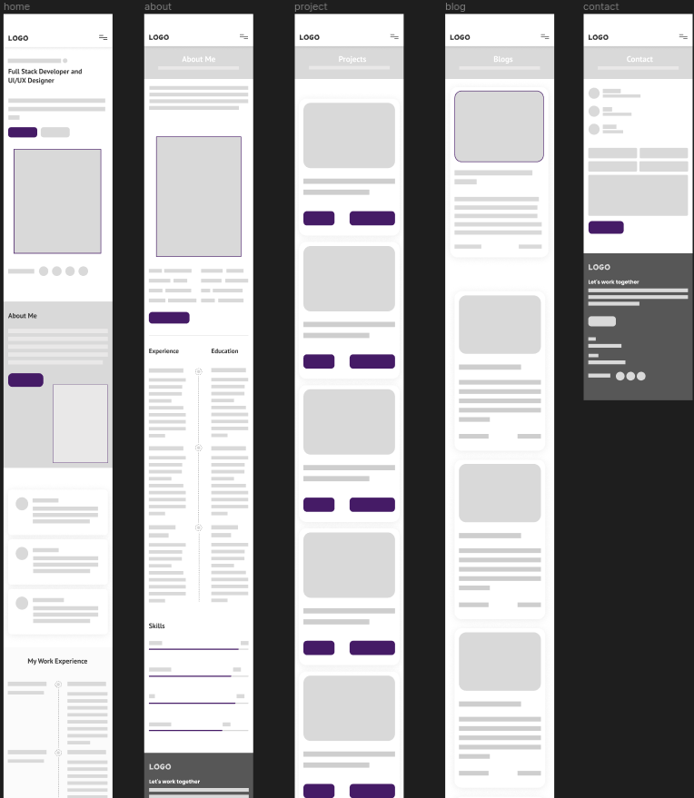
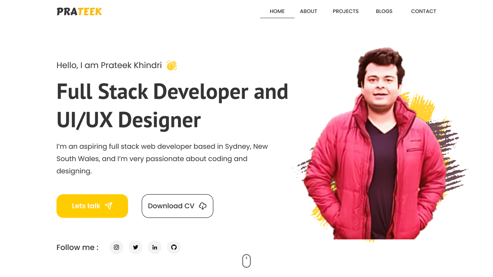
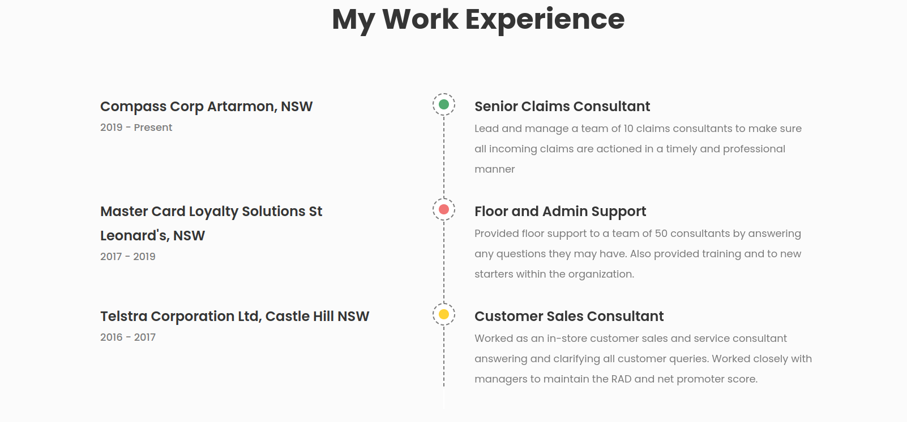
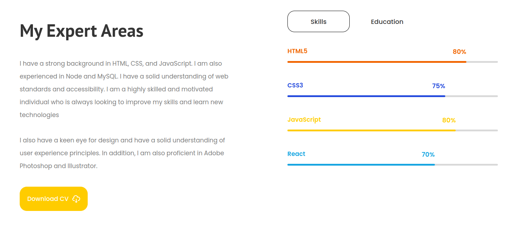
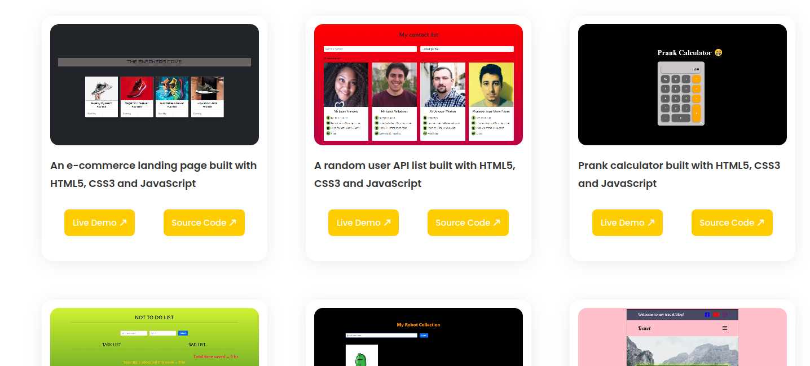
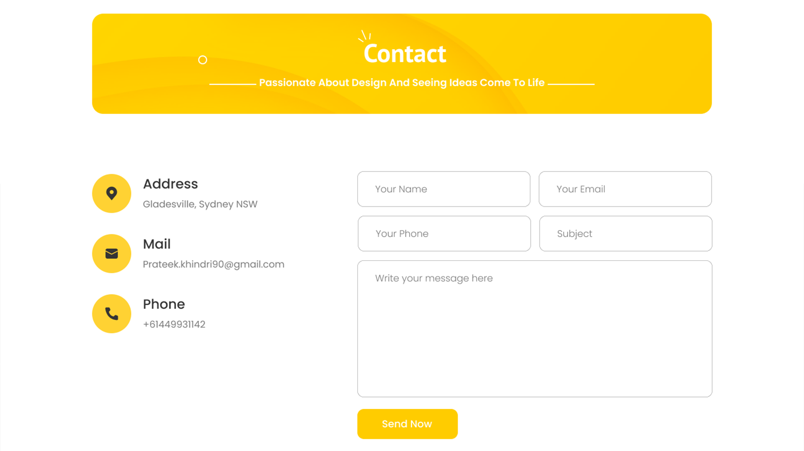
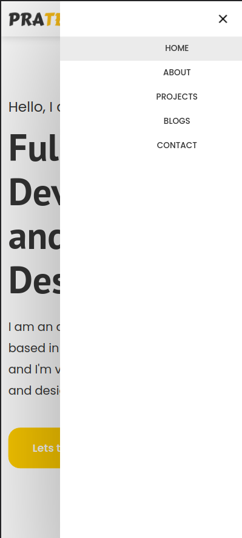

# Prateek Khindri's T1A2 Portfolio Website

The following is a README markdown document for Prateek Khindri's Portfolio Website.

## **Links to Prateek Khindri's Portfolio URL**

### **Prateek Khindri's deployed website**

Please visit the deployed portfolio website [by clicking here](https://prateekkhindriportfolio.netlify.app/). The site was deployed using [netlify](https://www.netlify.com/). Alternatively, please copy and paste the following link into a browser window.

```
https://prateekkhindriportfolio.netlify.app/
```

### **GitHub**

The github repository link can be found here [link](https://github.com/prateekkhindri/PrateekKhindri_T1A2).

### **Presentation Video**

The link to the video presentation can be found here [link](). The video was uploaded to

---

## **Description**

### **Purpose**

My website's primary goal is to promote my skills and attract future employers. I wanted to create an aesthetically appealing and user-friendly website. I also wanted to make sure that my website was viewable on mobile devices, as I know that this is a growing way for people to access the internet. I made my own portfolio website for a variety of reasons, primarily to showcase my work to future prospective employers or clients and also to interact with other like minded individuals.

### **Functionality / Features**

The website is divided into 5 individual pages. The homepage `home.html` includes a summary of my qualifications, experience, and education. Furthermore, the homepage links to each individual page on the website to improve the user experience. Each page has a header and a footer that includes links to Instagram, Twitter, LinkedIn, and GitHub. The project website includes a live demo as well as source code links to some of my previous work. The `contact page` includes my contact information as well as a static form.

- The website functions well on all devices, from desktop computers to cellphones, thanks to its **_responsive design_**.

- Visitors may find what they're seeking for fast and simply thanks to clear and **_intuitive navigation_**.

- On the home and about pages, there are **_resume download_** options.

- For tablet and mobile displays, the website features a **_hamburger-style_** sidemenu.

- All pages have been **_consistently styled_**, including components, colors, and fonts.

### **Sitemap**

This is the website's overall sitemap created on [FigJam](https://www.figma.com/file/EoW7QR0NRIkfuHl25yGRMF/T1A2-Portfolio-Sitemap?node-id=0%3A1)


### **Screenshots**

Please see the project screenshots below.

| #   | Description                                              | Image                                                              |
| --- | -------------------------------------------------------- | ------------------------------------------------------------------ |
| 1   | My daily tasks were managed using the `Trello workspace` |         |
| 2   | Desktop wireframe created using `Figma`                  |     |
| 3   | Mobile wireframe created using `Figma`                   |      |
| 4   | Hero section component                                   |                  |
| 5   | Work experience section component                        |    |
| 6   | Skills and education section component                   |  |
| 7   | List of projects section component                       |          |
| 8   | Contact form section component                           |          |
| 9   | Hamburger-style sidemenu component                       |      |

### **Target Audience**

Hiring managers, fellow developers, and potential clients are the intended audience for my personal portfolio website. The website highlights my developer talents, expertise, and projects. Anyone interested in my work as a developer should visit my personal portfolio page. Potential employers, clients, and collaborators are all included.

I also aim to continue updating my portfolio webpage as I continue to develop new skills. I am passionate about creating beautiful and useful websites, and I would love to collaborate with organisations to design and develop complicated web apps to match their requirements.

### **Tech Stack**

The portfolio was built using the following technological infrastructure:

- HTML
- CSS
- Figma
- Git
- Github
- Visual Studio Code
- Netlify
- Vimeo

The responsiveness of the website has been tested on the following devices:

- Desktop (1280 x 950), (1920 x 1080)
- Nest Hub and Nest Hub Max (1024 x 600), (1280 x 800)
- iPad Air and Mini (820 x 1180), (768 x 1024)
- iPhone 12 Pro, XR and SE (390 x 844), (414 x 896), (375 x 667)
- Samsung Galaxy A51/71 (412 x 914)
- Samsung Galaxy S8+ (360 x 740)
- Samsung Galaxy S20 Ultra (412 x 915)
- Surface Duo and Pro 7 (540 x 720), (912 x 1360)
